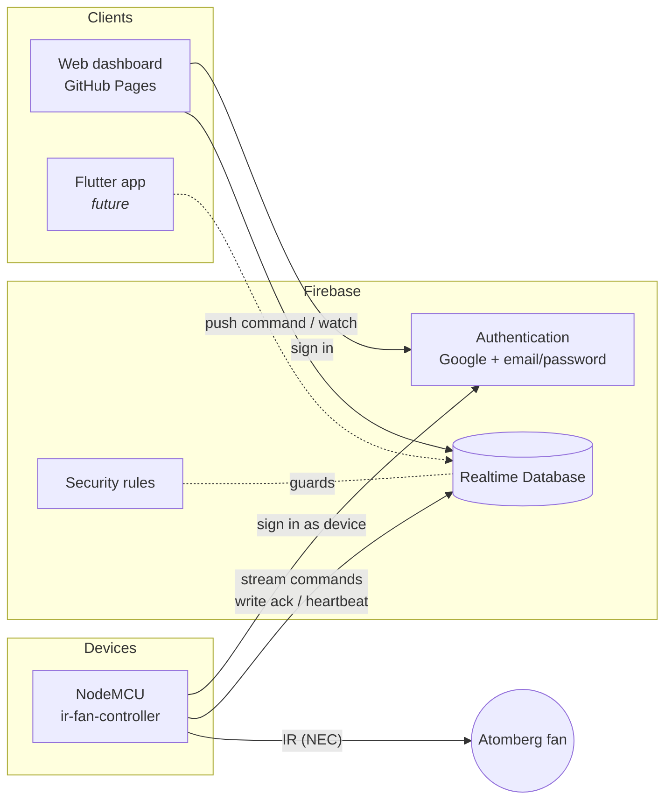
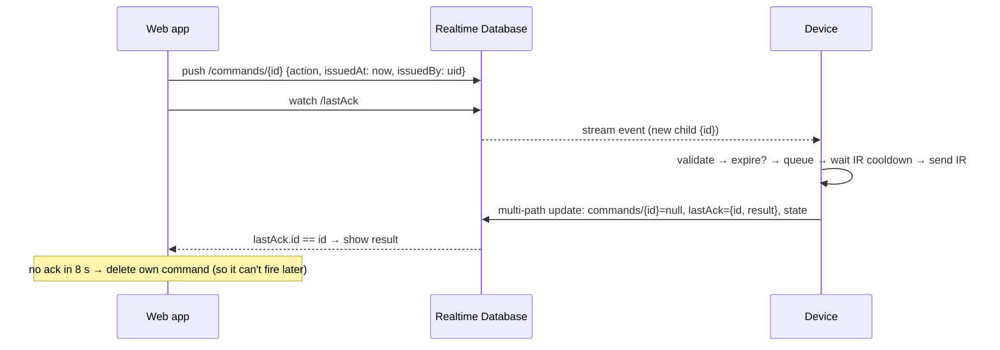

# Architecture

## Goals

- **Reachable anywhere, no IP hunting.** The UI lives at a fixed URL; devices
  connect *outbound* to the cloud, so no port forwarding or local discovery.
- **Safe to publish.** The repo and website are public; security comes from
  authentication and database rules, not from hidden URLs.
- **Grows by adding, not rewriting.** New device types, new clients
  (Flutter) and a new backend (Home Assistant) plug into stable seams.

## Components



| Component | Tech | Responsibility |
| --- | --- | --- |
| Web dashboard (`web/`) | Vanilla ES modules, Firebase JS SDK via CDN + import map | Sign-in, list devices, send commands, show online/ack state |
| Firebase Auth | Google (people), email/password (devices) | Identity for both people and devices |
| Realtime Database | Firebase RTDB | Command queue, device status, access lists |
| Security rules (`firebase/database.rules.json`) | RTDB rules | Who may read/write what |
| Firmware (`sketches/ir-fan-controller/`) | Arduino C++ on ESP8266, FirebaseClient, IRremoteESP8266 | Execute commands as IR codes, report status |

**Why Realtime Database (not Firestore)?** The ESP8266 can hold a live HTTP
stream to RTDB (server-sent events), so commands arrive in under a second
without polling. Firestore has no streaming listener on this hardware.

## Data model

```
/access
  /users/{uid}: true                  ← people allowed to use the dashboard (set by admin)
  /devices/{deviceId}: "{authUid}"    ← which auth account *is* each device (set by admin)

/devices/{deviceId}
  /info       { name, type, firmware, hardware, mac, bootedAt }   device writes on boot
  /status     { lastSeen, ip, rssi, uptimeSec, freeHeap }         device writes every 60 s
  /state      { lastAction, lastActionAt }                        device writes after executing
  /lastAck    { id, action, result, at }                          device writes per command
  /commands/{pushId}  { action, issuedAt, issuedBy }              people create; device deletes
```

- `info.type` (e.g. `"ir_fan"`) selects which UI card the web app renders.
- All timestamps are server timestamps (ms since epoch).
- **Presence** is heartbeat-based: a device is online if
  `serverNow - status.lastSeen < 150 s`. (RTDB's `onDisconnect` isn't
  available over the REST stream the ESP8266 uses.)

## Command protocol



Rules the firmware enforces:

| Rule | Why |
| --- | --- |
| Each command id executes **at most once** (recent ids remembered; re-deliveries are only dequeued) | Stream reconnects and phone write-retries can re-deliver a command; `power` is a toggle, so running it twice would switch the fan back |
| Commands older than 60 s are acked `expired`, not executed | A queued `power` must not fire long after it was pressed |
| At least 1 s between IR transmissions; extra commands queue (max 8) in issue order | Protects the IR LED; lets the fan register each code |
| Unknown actions are acked `unknown_action` | UI gets a clear error |

Ack `result` values: `ok`, `expired`, `unknown_action`, `busy`.

Action names are the contract between UI and firmware:
`power`, `speed_1` … `speed_5`, `boost`
(`web/js/devices/ir-fan/actions.js` ↔ `sketches/ir-fan-controller/src/devices/IrFan.cpp`).

IR is one-way, so the true fan state is unknown. The UI shows the **last sent**
action rather than a fake "fan is on".

## Security model

- **People** sign in with Google. Signing in grants nothing by itself: the
  UID must be added under `/access/users` by you (the admin, via the
  console). The dashboard shows the UID to copy.
- **Devices** sign in as their own email/password account. `/access/devices`
  binds a device id to that account, so a device can only read its own
  command queue and write its own status. It cannot read other devices or
  create commands.
- **Rules validate every command**: whitelisted fields, `action` matches
  `[a-z0-9_]{1,32}`, `issuedAt` must equal server time, `issuedBy` must be the
  caller, commands can't be overwritten, and people can only cancel their own.
  These are covered by an emulator test suite (31 cases).
- **Public config is fine.** The Firebase web `apiKey` identifies the project;
  it is not a secret. Firmware secrets (Wi-Fi, device password, OTA password)
  live in `secrets.h`, which is gitignored.
- **Known trade-off:** the ESP8266 skips TLS certificate verification
  (`setInsecure()`) because it lacks RAM for Google's CA chain. Someone
  on your LAN could in theory intercept the device's traffic. That's acceptable
  for a fan; for locks or garage doors, pin a certificate or use a local
  server.

## Firmware structure

```
sketches/ir-fan-controller/
  ir-fan-controller.ino   composition root + command policy
  config.h                device id, pins, timings (committed)
  secrets.h               Wi-Fi / Firebase / OTA credentials (gitignored)
  sketch.yaml             pinned core + library versions
  src/core/               Command, CommandQueue, Ntp, Log — transport-agnostic
  src/devices/IrFan       IR codes + cooldown — hardware driver
  src/net/                Wi-Fi (non-blocking), OTA updates
  src/cloud/FirebaseLink  the ONLY Firebase-aware code
```

The seam that matters: `cloud::` delivers `Command`s and accepts acks.
Replacing it (e.g. with MQTT) leaves the driver and command policy untouched.

## Web structure

```
web/
  index.html              shell + import map (Firebase SDK version pinned here)
  js/main.js              entry: setup screen or app
  js/app.js               auth-state router (login / no access / dashboard)
  js/config/              firebase + app constants
  js/services/            firebase, auth, devices (commands/acks), server time
  js/devices/registry.js  info.type → controls factory
  js/devices/ir-fan/      fan actions + controls
  js/ui/                  dom helper, toast, header, views
```

### Adding a new device type

1. Firmware: new sketch folder in `sketches/`, reuse `src/core`, `src/net`,
   `src/cloud` (copy now; extract to a shared library once there are 2–3
   devices), and set `DEVICE_TYPE` to a new value, e.g. `"relay"`.
2. Web: add `web/js/devices/relay/` with an actions list and
   `createRelayControls(device, context)`, then register it in
   `devices/registry.js`.
3. Firebase: create the device's auth user and add `/access/devices/{id}`.

## Roadmap

1. **More devices** on the same pattern (IR AC, relays, sensors that write to
   `status`).
2. **Flutter app** (`apps/`): FlutterFire against the same database and
   rules. No backend changes needed.
3. **Home Assistant on a Pi or mini PC.** Options, least to most change:
   - *Bridge*: HA automation/integration listens to Firebase and republishes
     to MQTT. Devices unchanged.
   - *Swap transport*: replace `src/cloud/FirebaseLink` with an MQTT client
     using HA MQTT discovery. Devices then work fully offline on the LAN.
   - *ESPHome*: reflash with ESPHome (it has native IR remote support); the
     IR codes in `IrFan.cpp` carry over directly.
4. **LAN fallback**: optional local HTTP endpoint on the device for when the
   internet is down.

## Known limitations

- Duplicate protection is kept in device RAM (last 16 ids). If a phone retries
  a write *and* the device reboots in that same moment, the command could
  run twice. This is very unlikely.
- Presence can lag up to about 2.5 minutes after a device goes offline.
- Firebase Spark (free) plan limits: 100 simultaneous connections, 1 GB
  stored, 10 GB/month downloaded. That's far beyond a household.
